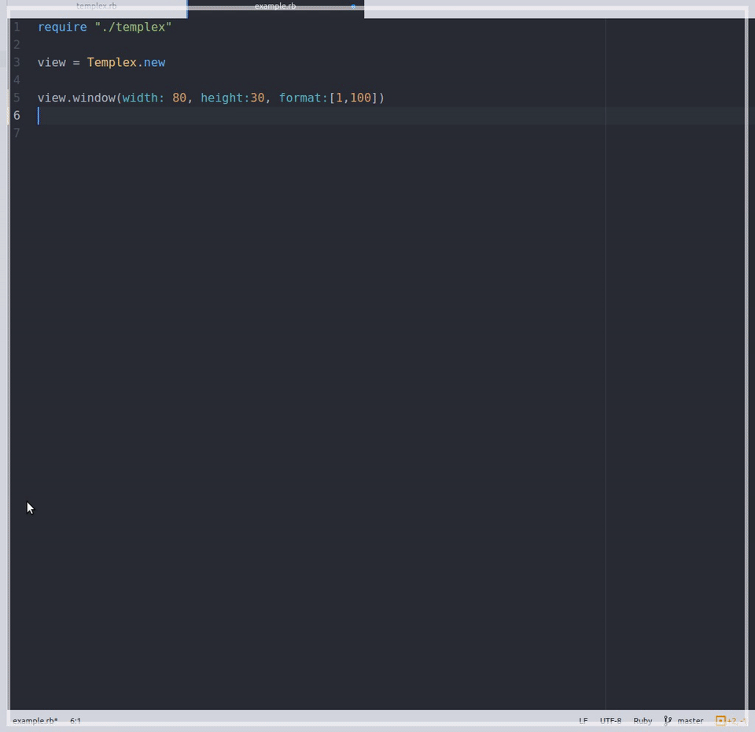
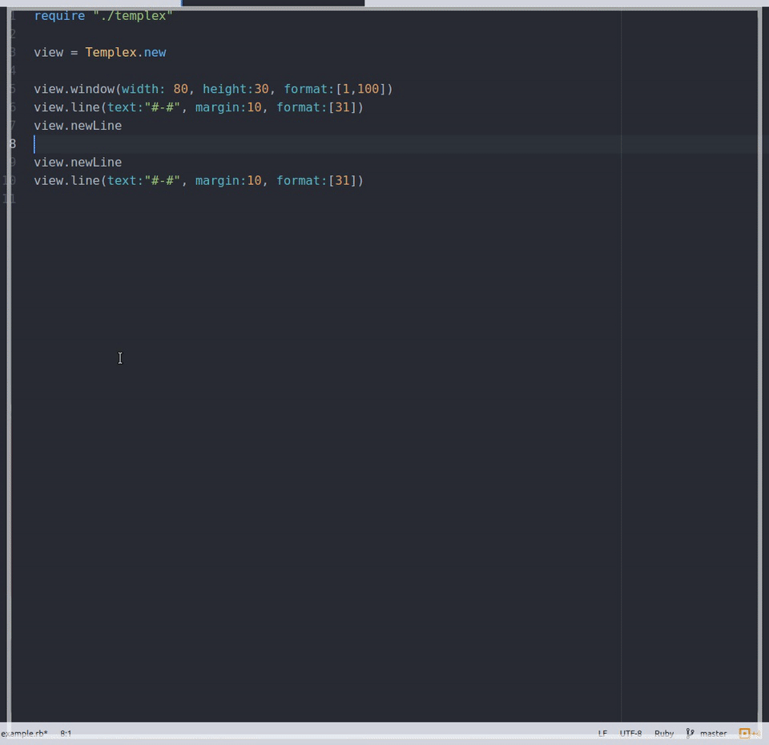

# TemplexForRuby
Templex is a view class for ruby terminal applications.

## Usage

Clone this repo and copy in your project folder:

```
$ git clone https://github.com/uCibar/TemplexForRuby.git
$ cp TemplexForRuby YourProjectFolder
```

Include Templex in your project:

```
require 'TemplexForRuby/templex'
```

New Instance:
```
main_menu = Templex.new
```

## Methods


### window method:

`window` method, changes terminal window `width` and `height`. Also `format` parameter set attributes for window; change background color, set bold, colorized text...

```
main_menu.window( width:Integer, height:Integer, format:[Bashcode,Bashcode,...] )
```

| Parameter   | Default | Must Be | 
| :-----------|:------- | :-----  |
| `width`     | 80      | Integer |
| `height`    | 30      | Integer |
| `format`    | ""      | Array   |

for example:
```
main_menu.window(width:100, height:30, format:[1,100])
```


What about `format`? What is 1 and 100?

1,100,32,etc. are bash codes!
1 is bold, 100 is gray for background, 32 is green for Foreground(text).

So, `format:[1,100]` changes background color and set bold text, Like CSS:
```
body{

background-color: #fff;
...
...
...

}
```
[List of Bash Codes](http://misc.flogisoft.com/bash/tip_colors_and_formatting)

You can create your own module for bashcodes:
```
module Colors

  RED = 31
  BOLD = 1
  GREEN = 32
  ...
  ...
  ...
  
end

main_manu.window(width:70, height:40, format:[Colors::RED, Colors::BOLD])
```

### line method:

`line` method, draws a line, like border! `text` parameter set your text, `margin` parameter set margin; 10,15,etc. `format` parameter
set attributes for line; background color, text color, etc.

```
main_menu.line( text:String, margin:Integer, format:[Bashcode,Bashcode,...] )
```

| Parameter   | Default | Must Be                           | 
| :-----------|:------- | :---------------------------------|
| `text`      | null    | String and not empty string; ""   |
| `margin`    | 0       | Integer                           |
| `format`    | ""      | Array                             |

for example:

```
main_menu.line(text:"#-#", margin:10, format:[31])
```



`format:[31]` set red text color...

### newLine method:

If you do not want to be side by side text, use `newLine` method. There is not parameter or someting else. Just write it:
`main_menu.newLine`

`line` method automatically add `newLine`, so you dont have to add. Also you can use for line space.

### title method:

Draw a text, set attributes for text; text color, etc. set text margin and if you want, center the text.

```
main_menu.title(text:String, center:boolean, margin:Integer, format:[You know it])
```

| Parameter   | Default | Must Be                           | 
| :-----------|:------- | :---------------------------------|
| `text`      | null    | String and not empty string; ""   |
| `center`    | false   | true or false                     |
| `margin`    | 0       | Integer                           |
| `format`    | ""      | Array                             |

- if you dont want centered text, you dont have to write `center:false`. `center` default `false`. 
- You shouldn't use `center:true` and `margin` together. Because `center:true` adjust `margin` automatically. So your `margin` unneeded.
- `center:true` adds `newLine` automatically.for example:

Title with `center:true`:
```
text:"Hello", center:true
text:"World", center:true
```
output:
```
Hello
World
```

Title with `center:false`:
```
text:"Hello" #no center:true
text:"World" #no center:true
```
output:
```
HelloWorld
```

Title with `newLine`:
```
text:"Hello" #no center:true
newLine
text:"World" #no center:true
```
output:
```
Hello
World
```

And here is the gif:

