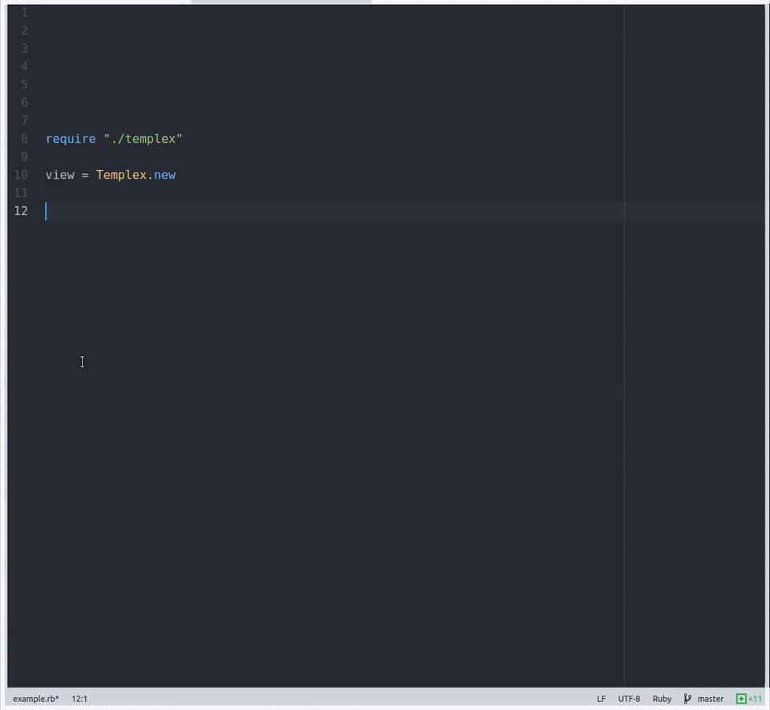

# TemplexForRuby
Templex is a view class for terminal applications.

## Usage

Clone this repo and copy in your project folder:

```
$ git clone https://github.com/uCibar/TemplexForRuby.git
$ cp TemplexForRuby YourProjectFolder
```

Include Templex in your project:

```
require 'TemplexForRuby/templex'
```

New Instance:
```
main_menu = Templex.new
```

## Methods


#### window method:

`window` method, changes terminal window `width` and `height`. Also `format` argument set attributes for window; change background color, set bold, colorized text...

```
main_menu.window( width:Integer, height:Integer, format:[Integer,Integer,...] )
```
for example:
```
main_menu.window(width:100, height:30, format:[1,100])
```



>width and height must be a integer, format must be; [Integer,Integer,...]

What about `format`? What is 1 and 100?

1,100,32,etc. are bash codes!
1 is bold, 100 is gray for background, 32 is green for Foreground(text).

So, `format:[1,100]` changes background and set bold text, Like CSS:
```
body{

background-color: #fff;
...
...
...

}
```
[List of Bash Codes](http://misc.flogisoft.com/bash/tip_colors_and_formatting)

You can create your own module for bashcodes:
```
module Colors

  RED = 31
  BOLD = 1
  GREEN = 32
  ...
  ...
  ...
  
end

main_manu.window(width:70, height:40, format:[Colors::RED, Colors::BOLD])
```
#### line method:
>Coming Soon!
